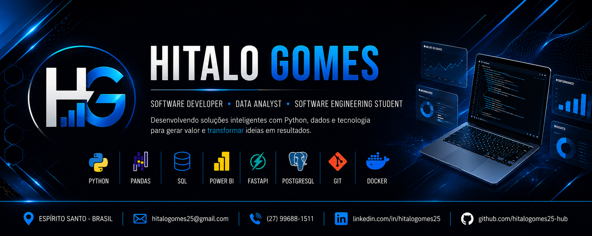

  

<h1 align="center">Hitalo Gomes 👋</h1>

<h3 align="center">
Software Developer • Data Analyst • Software Engineering Student
</h3>

  

---

# 👨‍💻 Sobre mim

Sou formado em **Análise e Desenvolvimento de Sistemas** e atualmente curso **Pós-graduação em Engenharia de Software**.

Tenho experiência com desenvolvimento de software, análise de dados, automação de processos e Business Intelligence.

Meu objetivo é desenvolver soluções modernas, escaláveis e bem estruturadas utilizando boas práticas de programação.

Atualmente estou focado em:

- 🐍 Desenvolvimento Python
- 📊 Análise de Dados
- ⚙️ Engenharia de Software
- 🌐 APIs REST
- 📈 Business Intelligence

---

# 🚀 Atualmente estudando

- Python Avançado
- Engenharia de Dados
- FastAPI
- Docker
- SQL
- PostgreSQL
- Arquitetura de Software
- Power BI
- Git e GitHub

---

# 🛠️ Stack Tecnológica

## Linguagens

---

## Backend

---

## Banco de Dados

---

## Data Analytics

---

## Ferramentas

---

# 📊 GitHub Analytics

---

---

# 🏆 Projetos

### 📊 TecPrime Data Generator

Gerador de dados fictícios para testes, dashboards e Business Intelligence.

**Stack**

Python • Pandas • OpenPyXL

https://github.com/hitalogomes25-hub/tecprime-data-generator
---

### ⚙️ TecPrime ETL Pipeline

Pipeline de Engenharia de Dados utilizando Python.

**Stack**

Python • SQL • PostgreSQL • Pandas

https://github.com/hitalogomes25-hub/tecprime-etl-pipeline

---

### 🌐 TecPrime API

API REST moderna desenvolvida com FastAPI.

**Stack**

FastAPI • PostgreSQL

---

### 📈 TecPrime Dashboard

Dashboard profissional para análise de indicadores.

**Stack**

Power BI • DAX • Power Query

---

# 📚 Formação

🎓 Tecnólogo em **Análise e Desenvolvimento de Sistemas**

🎓 Pós-graduação em **Engenharia de Software** *(Em andamento)*

---

# 🎯 Objetivos

✔ Desenvolver aplicações escaláveis

✔ Criar APIs modernas

✔ Engenharia de Dados

✔ Business Intelligence

✔ Desenvolvimento Backend

✔ Aprender continuamente novas tecnologias

---

# 📈 Contribuições

---

# 🌎 Onde me encontrar

---

### 💙 Obrigado pela visita!

*"Code. Learn. Build. Improve."*

⭐ Se algum projeto chamou sua atenção, fique à vontade para explorá-lo ou entrar em contato.

